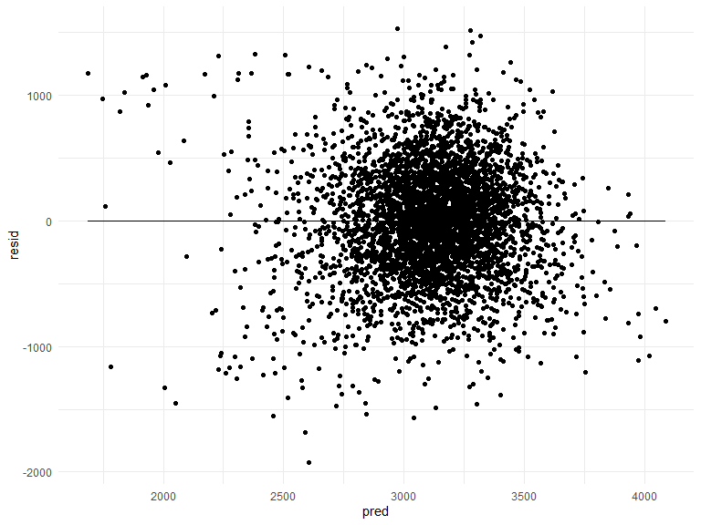
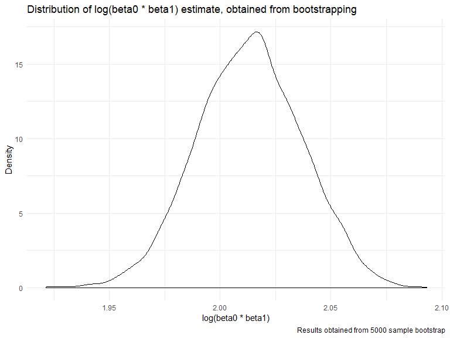
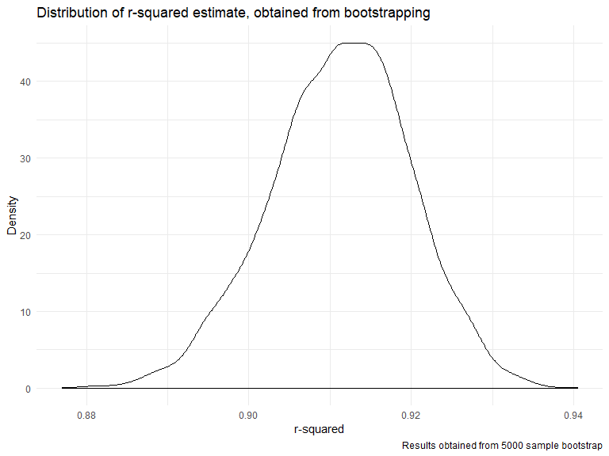

p8105\_hw6\_ha2546
================
Hana Akbarnejad
11/27/2019

## Load and clean data

``` r
birthweight_data = read_csv("data/birthweight.csv") %>% 
  rename_at(vars(starts_with ("b")), 
  funs(str_replace(., "b", "baby_"))
  ) %>% 
  rename_at(vars(starts_with ("m")), 
  funs(str_replace(., "m", "mother_"))
  ) %>%
  rename_all(
  funs(str_replace(., "wt", "weight"))    
  ) %>% 
  rename(
    baby_sex = baby_abysex,
    father_race = frace,
    family_income = fincome,
    mother_delivery_weight = delweight,
    gestational_age = gaweeks,
    malformation = mother_alform,
    mother_menarche = mother_enarche,
    mother_delivery_age= mother_omage,
    past_live_birth = parity,
    past_low_birth = pnumlbw,
    past_small_birth = pnumsga,
    pre_preg_bmi = ppbmi,
    pre_preg_weight = ppweight,
    weight_gain = weightgain
  ) %>% 
  mutate(
    baby_sex = factor(baby_sex),
    father_race = factor(father_race),
    malformation = factor(malformation),
    mother_race = factor(mother_race)
  )
```

    ## Parsed with column specification:
    ## cols(
    ##   .default = col_double()
    ## )

    ## See spec(...) for full column specifications.

``` r
sum(is.na(birthweight_data))
```

    ## [1] 0

factored the numeric renamed variables

Firs, take a look at the distribution of birth weight:

``` r
birthweight_data %>% 
  ggplot(aes(x = baby_weight)) + geom_density()
```


Although a little skewed to the left, the data is normally distributed.

Working on model: To build this model, I use a combination of backward
model building and the information I obtained through a brief research
on factors affecting birthweight. Variables I assume might be
influential and I wan to start with: gestational age, mother delivery
age, pre pregnancy BMI, mother’s weight gain during pregnancy, number of
cigarettes smoken during pregnancy, and family income.

``` r
fit1 = birthweight_data %>% 
  lm(baby_weight ~ gestational_age + mother_delivery_age + pre_preg_bmi + weight_gain + smoken + family_income, data = .) 

fit1 %>% 
  broom::tidy()
```

    ## # A tibble: 7 x 5
    ##   term                estimate std.error statistic   p.value
    ##   <chr>                  <dbl>     <dbl>     <dbl>     <dbl>
    ## 1 (Intercept)           -55.8     98.2      -0.568 5.70e-  1
    ## 2 gestational_age        58.6      2.19     26.8   3.29e-146
    ## 3 mother_delivery_age    10.6      1.86      5.66  1.57e-  8
    ## 4 pre_preg_bmi           16.8      2.14      7.83  5.93e- 15
    ## 5 weight_gain            10.2      0.631    16.1   1.28e- 56
    ## 6 smoken                 -7.57     0.916    -8.27  1.84e- 16
    ## 7 family_income           2.06     0.276     7.45  1.08e- 13

explaining model: \#\#\#\#\#\#\#\#\#\#\#\#\#\#\#\#\#\#

plotting the residuals against fitted values:

``` r
birthweight_data %>% 
  add_residuals(fit1) %>% 
  add_predictions(fit1) %>% 
  ggplot(aes(x = pred, y = resid)) + geom_point() + geom_line(y = 0)
```



This is what we expect: residuals randomly distributed bouncing around
zero.

# comparisons

first lets just see the models

``` r
model1 = birthweight_data %>% 
  lm(baby_weight ~ baby_length + gestational_age, data = .)

model1 %>% 
  broom::tidy()
```

    ## # A tibble: 3 x 5
    ##   term            estimate std.error statistic  p.value
    ##   <chr>              <dbl>     <dbl>     <dbl>    <dbl>
    ## 1 (Intercept)      -4348.      98.0      -44.4 0.      
    ## 2 baby_length        129.       1.99      64.6 0.      
    ## 3 gestational_age     27.0      1.72      15.7 2.36e-54

``` r
model2 = birthweight_data %>% 
  lm(baby_weight ~ baby_length + baby_head + baby_sex + baby_length*baby_head*baby_sex, data = .)

model2 %>% 
  broom::tidy()
```

    ## # A tibble: 8 x 5
    ##   term                             estimate std.error statistic     p.value
    ##   <chr>                               <dbl>     <dbl>     <dbl>       <dbl>
    ## 1 (Intercept)                     -7177.     1265.       -5.67      1.49e-8
    ## 2 baby_length                       102.       26.2       3.90      9.92e-5
    ## 3 baby_head                         182.       38.1       4.78      1.84e-6
    ## 4 baby_sex2                        6375.     1678.        3.80      1.47e-4
    ## 5 baby_length:baby_head              -0.554     0.780    -0.710     4.78e-1
    ## 6 baby_length:baby_sex2            -124.       35.1      -3.52      4.29e-4
    ## 7 baby_head:baby_sex2              -198.       51.1      -3.88      1.05e-4
    ## 8 baby_length:baby_head:baby_sex2     3.88      1.06      3.67      2.45e-4

Automated CV using modelr…

``` r
# train/test split using resampling
cv_df = 
  crossv_mc(birthweight_data, 100) 

# conversting train and test lists to tibbles (I assume we don't have to because all lm???)
cv_df = cv_df %>%
  mutate(
    train = map(train, as_tibble),
    test = map(test, as_tibble)
    )

# obtaining RMSE of our models:
cv_df = cv_df %>% 
  mutate(
    fit1  = map(train, ~lm(baby_weight ~ gestational_age + mother_delivery_age + pre_preg_bmi + weight_gain + smoken + family_income, data = .x)),
    model1  = map(train, ~lm(baby_weight ~ baby_length + gestational_age, data = .x)),
    model2  = map(train, ~lm(baby_weight ~ baby_length + baby_head + baby_sex + baby_length * baby_head * baby_sex, data = .x))) %>% 
  mutate(
    rmse_fit1 = map2_dbl(fit1, test, ~rmse(model = .x, data = .y)),
    rmse_model1 = map2_dbl(model1, test, ~rmse(model = .x, data = .y)),
    rmse_model2 = map2_dbl(model2, test, ~rmse(model = .x, data = .y)))
```

I used RMSE as a way to compare these models, and the plot below shows
the distribution of RMSE values for each candidate model (fit1, model1,
model2):

``` r
cv_df %>% 
  select(starts_with("rmse")) %>% 
  pivot_longer(
    everything(),
    names_to = "model", 
    values_to = "rmse",
    names_prefix = "rmse_") %>% 
  mutate(model = fct_inorder(model)) %>% 
  ggplot(aes(x = model, y = rmse)) + geom_violin()
```


# comment on graphs.

# Problem 2

loadind weather data:

``` r
weather_df = 
  rnoaa::meteo_pull_monitors(
    c("USW00094728"),
    var = c("PRCP", "TMIN", "TMAX"), 
    date_min = "2017-01-01",
    date_max = "2017-12-31") %>%
  mutate(
    name = recode(id, USW00094728 = "CentralPark_NY"),
    tmin = tmin / 10,
    tmax = tmax / 10) %>%
  select(name, id, everything())
```

    ## Registered S3 method overwritten by 'crul':
    ##   method                 from
    ##   as.character.form_file httr

    ## Registered S3 method overwritten by 'hoardr':
    ##   method           from
    ##   print.cache_info httr

    ## file path:          C:\Users\Halbatross\AppData\Local\rnoaa\rnoaa\Cache/ghcnd/USW00094728.dly

    ## file last updated:  2019-09-26 10:26:51

    ## file min/max dates: 1869-01-01 / 2019-09-30

fit a linear regression with tmax as response and tmin as predictor:

``` r
weather_model = weather_df %>% 
  lm(tmax ~ tmin, data = .)

weather_model %>%
  broom::tidy() %>% 
  knitr::kable()
```

| term        | estimate | std.error | statistic | p.value |
| :---------- | -------: | --------: | --------: | ------: |
| (Intercept) | 7.208502 | 0.2263474 |  31.84707 |       0 |
| tmin        | 1.039241 | 0.0169919 |  61.16096 |       0 |

Now, we want to use bootsrap to make inference about this data\!

First step is writing bootstrap function (to draw one sample with
replacement), and then, I apply the function to draw 5000 samples:

``` r
boot_sample = function(df) {
  sample_frac(df, replace = TRUE)
}

boot_straps = 
  data_frame(
    strap_number = 1:5000,
    strap_sample = rerun(5000, boot_sample(weather_df))
  )
```

for each bootstrap sample, produce estimates of
 and ") quantities. first, we should
extract values of
,
, and
 from the linear model that we have, using broom::tidy()
and broom::glance().

``` r
boot_analysis = boot_straps %>% 
  mutate(
    models = map(strap_sample, ~lm(tmax ~ tmin, data = .x) ),   
    results_coeff = map(models, broom::tidy), # to get coefficients                     
    results_r2 = map(models, broom::glance) # to get r^2
  ) %>%
  select(-strap_sample, -models) %>% 
  unnest() %>% 
  select(strap_number, term, estimate, r.squared) # selecting variables I'm gonna use

# to extract coefficients from bootstrap results and take the log:
boot_estimates = boot_analysis %>% 
  pivot_wider(
    names_from = term,
    values_from = estimate
  ) %>% 
  rename(
    beta0 = "(Intercept)",
    beta1 = "tmin",
    r_squared = "r.squared"
  ) %>% 
  mutate(
    log_coeff = log(beta0*beta1)
  )
```

Next step is graphing the distribution of our estimates that are
obtained:

``` r
# plotting the distribution of estimates:
boot_estimates %>% 
  ggplot(aes(x = log_coeff)) + geom_density() +
  labs(
    x = "log(beta0 * beta1)",
    y = "Density",
    title = "Distribution of log(beta0 * beta1) estimate, obtained from bootstrapping",
    caption = "Results obtained from 5000 sample bootstrap"
  )
```



``` r
boot_estimates %>% 
  ggplot(aes(x = r_squared)) + geom_density() +
  labs(
    x = "r-squared",
    y = "Density",
    title = "Distribution of r-squared estimate, obtained from bootstrapping",
    caption = "Results obtained from 5000 sample bootstrap"
  )
```



# comment on distributions\!

In this part, I identified the 2.5% and 97.5% quantiles to provide a 95%
confidence interval for
 and ")

``` r
quantile(pull(boot_estimates, log_coeff), c(0.25, 0.75))
```

    ##      25%      75% 
    ## 1.997090 2.029363

``` r
quantile(pull(boot_estimates, r_squared), c(0.25, 0.75))
```

    ##       25%       75% 
    ## 0.9055943 0.9172077

We can see that 95% confidence interval is (1.997025, 2.029787) for
") and (0.9056913 , 0.9171143)
for .
