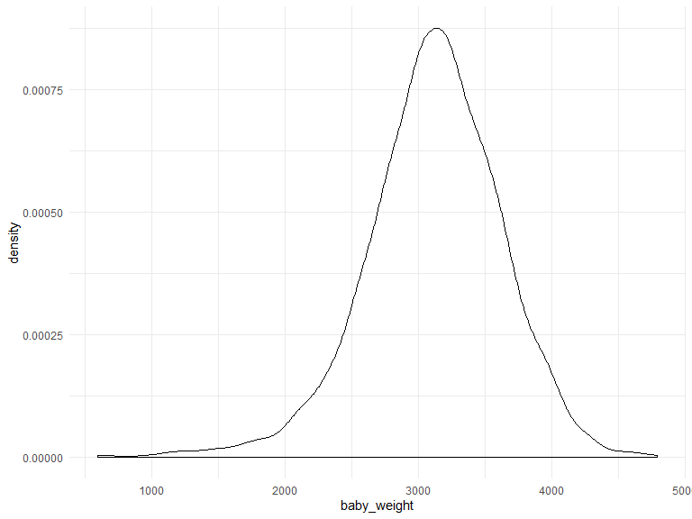

p8105\_hw6\_ha2546
================
Hana Akbarnejad
11/27/2019

# Problem 1

## Load and clean data

``` r
birthweight_data = read_csv("data/birthweight.csv") %>% 
  rename_at(vars(starts_with ("b")), 
  funs(str_replace(., "b", "baby_"))
  ) %>% 
  rename_at(vars(starts_with ("m")), 
  funs(str_replace(., "m", "mother_"))
  ) %>%
  rename_all(
  funs(str_replace(., "wt", "weight"))    
  ) %>% 
  rename(
    baby_sex = baby_abysex,
    father_race = frace,
    family_income = fincome,
    mother_delivery_weight = delweight,
    gestational_age = gaweeks,
    malformation = mother_alform,
    mother_menarche = mother_enarche,
    mother_delivery_age= mother_omage,
    past_live_birth = parity,
    past_low_birth = pnumlbw,
    past_small_birth = pnumsga,
    pre_preg_bmi = ppbmi,
    pre_preg_weight = ppweight,
    weight_gain = weightgain
  ) %>% 
  mutate(
    baby_sex = factor(baby_sex),
    father_race = factor(father_race),
    malformation = factor(malformation),
    mother_race = factor(mother_race)
  )
```

    ## Parsed with column specification:
    ## cols(
    ##   .default = col_double()
    ## )

    ## See spec(...) for full column specifications.

``` r
sum(is.na(birthweight_data))
```

    ## [1] 0

In this part, I loaded and cleaned the data. I renamed variables in a
way that are more comprehendible, and factored the numeric variables.
Using *is.na* function, and taking the sum, no missing values found in
the datset. The *birthweight\_data* is a dataset of 4342 observations of
20 variables that might be associated with babyweight, such as babies
sex and height, race/ethnicity of parents, family income, and
informations about mother’s age, weight, bmi, etc, both pre pregnancy
and at the time of delivery. The birthweight of babies that is our
dependent variable of interest in these problems (response), has the
mean of 3114.4039613  512.1540963 grams or 3.114404
 0.5121541
kilograms, with median of 3132.5 gr (3.1325 kg).

The below plots shows the distribution of birth weight:

``` r
birthweight_data %>% 
  ggplot(aes(x = baby_weight)) + geom_density()
```


Although a little skewed to the left, the data is normally distributed.

## Propose Regression Model

The purose of this part is to propose a regression model for
birthweight. Since the sample size is huge, it is going to be hard to
build a model because in such big datasets, almost all variable show
significance, so using stepwise approaches would not be very helpful.
So, my model is mostly relied on literature review and then I check the
validity of my model.

As we are looking for a predictive model, I first start with excluding
factors that I don’t find very relevant, and/or have not been mentioned
in previous literature, or have shown to have non-signiicant effects on
baby birthweight. The factors thaat are left to consider are:
*baby\_head*, *babylength*, *gestational\_age*, *prepreg\_bmi*,
*malformation*, *smoken*.

Now that I reduced 19 predictors to 6, I include factors that are
logically associated with birthweight of babies and are related to
babies and not other factors. Babies with higher gestational age are
going to be heavier and heavier babies would have bigger heads, and
would be generally “bigger”, so they would have higher height. Since all
these factors are related to each other, I would use interaction term
between thse three factors. So, my first proposed model is:

``` r
fit1 = birthweight_data %>% 
  lm(baby_weight ~ baby_head*baby_length*gestational_age, data = .) 

fit1 %>% 
  summary()
```

    ## 
    ## Call:
    ## lm(formula = baby_weight ~ baby_head * baby_length * gestational_age, 
    ##     data = .)
    ## 
    ## Residuals:
    ##      Min       1Q   Median       3Q      Max 
    ## -1104.35  -189.62    -9.56   177.57  2717.95 
    ## 
    ## Coefficients:
    ##                                         Estimate Std. Error t value
    ## (Intercept)                            1.597e+04  4.630e+03   3.449
    ## baby_head                             -5.651e+02  1.498e+02  -3.773
    ## baby_length                           -4.361e+02  1.064e+02  -4.098
    ## gestational_age                       -4.874e+02  1.357e+02  -3.592
    ## baby_head:baby_length                  1.627e+01  3.253e+00   5.003
    ## baby_head:gestational_age              1.601e+01  4.260e+00   3.759
    ## baby_length:gestational_age            1.185e+01  2.978e+00   3.980
    ## baby_head:baby_length:gestational_age -3.737e-01  8.976e-02  -4.163
    ##                                       Pr(>|t|)    
    ## (Intercept)                           0.000567 ***
    ## baby_head                             0.000163 ***
    ## baby_length                           4.24e-05 ***
    ## gestational_age                       0.000332 ***
    ## baby_head:baby_length                 5.86e-07 ***
    ## baby_head:gestational_age             0.000173 ***
    ## baby_length:gestational_age           7.01e-05 ***
    ## baby_head:baby_length:gestational_age 3.20e-05 ***
    ## ---
    ## Signif. codes:  0 '***' 0.001 '**' 0.01 '*' 0.05 '.' 0.1 ' ' 1
    ## 
    ## Residual standard error: 285 on 4334 degrees of freedom
    ## Multiple R-squared:  0.6908, Adjusted R-squared:  0.6903 
    ## F-statistic:  1383 on 7 and 4334 DF,  p-value: < 2.2e-16

Now, I add smoking status of mother to the model:

``` r
fit2 = birthweight_data %>% 
  lm(baby_weight ~ baby_head*baby_length*gestational_age + smoken, data = .) 

fit2 %>% 
  summary()
```

    ## 
    ## Call:
    ## lm(formula = baby_weight ~ baby_head * baby_length * gestational_age + 
    ##     smoken, data = .)
    ## 
    ## Residuals:
    ##      Min       1Q   Median       3Q      Max 
    ## -1111.32  -189.98   -10.53   176.25  2700.97 
    ## 
    ## Coefficients:
    ##                                         Estimate Std. Error t value
    ## (Intercept)                            1.571e+04  4.627e+03   3.395
    ## baby_head                             -5.573e+02  1.496e+02  -3.724
    ## baby_length                           -4.306e+02  1.063e+02  -4.049
    ## gestational_age                       -4.795e+02  1.356e+02  -3.536
    ## smoken                                -1.777e+00  5.865e-01  -3.029
    ## baby_head:baby_length                  1.611e+01  3.250e+00   4.956
    ## baby_head:gestational_age              1.580e+01  4.257e+00   3.711
    ## baby_length:gestational_age            1.170e+01  2.975e+00   3.931
    ## baby_head:baby_length:gestational_age -3.693e-01  8.968e-02  -4.118
    ##                                       Pr(>|t|)    
    ## (Intercept)                           0.000693 ***
    ## baby_head                             0.000198 ***
    ## baby_length                           5.23e-05 ***
    ## gestational_age                       0.000411 ***
    ## smoken                                0.002467 ** 
    ## baby_head:baby_length                 7.45e-07 ***
    ## baby_head:gestational_age             0.000209 ***
    ## baby_length:gestational_age           8.60e-05 ***
    ## baby_head:baby_length:gestational_age 3.89e-05 ***
    ## ---
    ## Signif. codes:  0 '***' 0.001 '**' 0.01 '*' 0.05 '.' 0.1 ' ' 1
    ## 
    ## Residual standard error: 284.8 on 4333 degrees of freedom
    ## Multiple R-squared:  0.6914, Adjusted R-squared:  0.6909 
    ## F-statistic:  1214 on 8 and 4333 DF,  p-value: < 2.2e-16

since adding smoking status has a very negligible effect on
, and its
p-value is the highest between all other values, I omit that from my
model, and add malformation to my model:

``` r
fit3 = birthweight_data %>% 
  lm(baby_weight ~ baby_head*baby_length*gestational_age + malformation, data = .) 

fit3 %>% 
  summary()
```

    ## 
    ## Call:
    ## lm(formula = baby_weight ~ baby_head * baby_length * gestational_age + 
    ##     malformation, data = .)
    ## 
    ## Residuals:
    ##      Min       1Q   Median       3Q      Max 
    ## -1104.20  -189.82    -9.44   177.60  2718.44 
    ## 
    ## Coefficients:
    ##                                         Estimate Std. Error t value
    ## (Intercept)                            1.594e+04  4.631e+03   3.443
    ## baby_head                             -5.635e+02  1.498e+02  -3.761
    ## baby_length                           -4.359e+02  1.064e+02  -4.095
    ## gestational_age                       -4.866e+02  1.357e+02  -3.585
    ## malformation1                          3.705e+01  7.380e+01   0.502
    ## baby_head:baby_length                  1.625e+01  3.253e+00   4.996
    ## baby_head:gestational_age              1.597e+01  4.262e+00   3.747
    ## baby_length:gestational_age            1.184e+01  2.978e+00   3.976
    ## baby_head:baby_length:gestational_age -3.730e-01  8.977e-02  -4.155
    ##                                       Pr(>|t|)    
    ## (Intercept)                           0.000582 ***
    ## baby_head                             0.000171 ***
    ## baby_length                           4.29e-05 ***
    ## gestational_age                       0.000341 ***
    ## malformation1                         0.615644    
    ## baby_head:baby_length                 6.10e-07 ***
    ## baby_head:gestational_age             0.000181 ***
    ## baby_length:gestational_age           7.11e-05 ***
    ## baby_head:baby_length:gestational_age 3.31e-05 ***
    ## ---
    ## Signif. codes:  0 '***' 0.001 '**' 0.01 '*' 0.05 '.' 0.1 ' ' 1
    ## 
    ## Residual standard error: 285.1 on 4333 degrees of freedom
    ## Multiple R-squared:  0.6908, Adjusted R-squared:  0.6902 
    ## F-statistic:  1210 on 8 and 4333 DF,  p-value: < 2.2e-16

We can observe that malformation effect is not significant in our model
and it has a high p-value compared to other terms. So, I remove that
factor from my model and go with the last predictor that I think might
be helpful, which is *prepreg\_bmi*:

``` r
fit4 = birthweight_data %>% 
  lm(baby_weight ~ baby_head*baby_length*gestational_age + pre_preg_bmi, data = .) 

fit4 %>% 
  summary()
```

    ## 
    ## Call:
    ## lm(formula = baby_weight ~ baby_head * baby_length * gestational_age + 
    ##     pre_preg_bmi, data = .)
    ## 
    ## Residuals:
    ##      Min       1Q   Median       3Q      Max 
    ## -1138.13  -190.71    -9.66   178.81  2704.53 
    ## 
    ## Coefficients:
    ##                                         Estimate Std. Error t value
    ## (Intercept)                            1.582e+04  4.628e+03   3.418
    ## baby_head                             -5.625e+02  1.497e+02  -3.758
    ## baby_length                           -4.339e+02  1.064e+02  -4.079
    ## gestational_age                       -4.861e+02  1.356e+02  -3.583
    ## pre_preg_bmi                           3.268e+00  1.365e+00   2.394
    ## baby_head:baby_length                  1.621e+01  3.251e+00   4.985
    ## baby_head:gestational_age              1.598e+01  4.258e+00   3.752
    ## baby_length:gestational_age            1.182e+01  2.976e+00   3.971
    ## baby_head:baby_length:gestational_age -3.728e-01  8.971e-02  -4.155
    ##                                       Pr(>|t|)    
    ## (Intercept)                           0.000638 ***
    ## baby_head                             0.000174 ***
    ## baby_length                           4.60e-05 ***
    ## gestational_age                       0.000343 ***
    ## pre_preg_bmi                          0.016689 *  
    ## baby_head:baby_length                 6.45e-07 ***
    ## baby_head:gestational_age             0.000178 ***
    ## baby_length:gestational_age           7.29e-05 ***
    ## baby_head:baby_length:gestational_age 3.31e-05 ***
    ## ---
    ## Signif. codes:  0 '***' 0.001 '**' 0.01 '*' 0.05 '.' 0.1 ' ' 1
    ## 
    ## Residual standard error: 284.9 on 4333 degrees of freedom
    ## Multiple R-squared:  0.6912, Adjusted R-squared:  0.6906 
    ## F-statistic:  1212 on 8 and 4333 DF,  p-value: < 2.2e-16

This factor as well is not very significant and does not considerable
improve the value of adjusted
. So my final
model is the first version of my model which was named *fit1*.

## Model Diagnostics

Next, I should plot the residuals against fitted values to check the
constant variance assumption and ensure validity of my model.

``` r
birthweight_data %>% 
  add_residuals(fit1) %>% 
  add_predictions(fit1) %>% 
  ggplot(aes(x = pred, y = resid)) + geom_point() + geom_line(y = 0)
```


We can observe randomness which shows homoscedasticity (constant
variance) in residuals. This indicates that my model is correctly
specified and there is no corrolation between residuals and fitted
values. So, there is no need for transformations in my outcome or
predictor, and that the linear model is working well, so, we do not need
to consider higher order regression models. The only concern is the few
points that look like outliers. we can look into them to see if these
outliers are influential points or not, but because our sample size is
very big, the presence of these points should not be problematic.

## Model Comparison, Cross Validation

first lets just see the models

``` r
model1 = birthweight_data %>% 
  lm(baby_weight ~ baby_length + gestational_age, data = .)

model1 %>% 
  broom::tidy()
```

    ## # A tibble: 3 x 5
    ##   term            estimate std.error statistic  p.value
    ##   <chr>              <dbl>     <dbl>     <dbl>    <dbl>
    ## 1 (Intercept)      -4348.      98.0      -44.4 0.      
    ## 2 baby_length        129.       1.99      64.6 0.      
    ## 3 gestational_age     27.0      1.72      15.7 2.36e-54

``` r
model2 = birthweight_data %>% 
  lm(baby_weight ~ baby_length*baby_head*baby_sex, data = .)

model2 %>% 
  broom::tidy()
```

    ## # A tibble: 8 x 5
    ##   term                             estimate std.error statistic     p.value
    ##   <chr>                               <dbl>     <dbl>     <dbl>       <dbl>
    ## 1 (Intercept)                     -7177.     1265.       -5.67      1.49e-8
    ## 2 baby_length                       102.       26.2       3.90      9.92e-5
    ## 3 baby_head                         182.       38.1       4.78      1.84e-6
    ## 4 baby_sex2                        6375.     1678.        3.80      1.47e-4
    ## 5 baby_length:baby_head              -0.554     0.780    -0.710     4.78e-1
    ## 6 baby_length:baby_sex2            -124.       35.1      -3.52      4.29e-4
    ## 7 baby_head:baby_sex2              -198.       51.1      -3.88      1.05e-4
    ## 8 baby_length:baby_head:baby_sex2     3.88      1.06      3.67      2.45e-4

I used automated cross calidation process using modelr…

``` r
# train/test split using resampling
cv_df = 
  crossv_mc(birthweight_data, 100) 

# conversting train and test lists to tibbles (I assume we don't have to because all lm???)
cv_df = cv_df %>%
  mutate(
    train = map(train, as_tibble),
    test = map(test, as_tibble)
    )

# obtaining RMSE of our models:
cv_df = cv_df %>% 
  mutate(
    fit1  = map(train, ~lm(baby_weight ~ baby_head*baby_length*gestational_age, data = .)),
    model1  = map(train, ~lm(baby_weight ~ baby_length + gestational_age, data = .x)),
    model2  = map(train, ~lm(baby_weight ~ baby_length * baby_head * baby_sex, data = .x))) %>% 
  mutate(
    rmse_fit1 = map2_dbl(fit1, test, ~rmse(model = .x, data = .y)),
    rmse_model1 = map2_dbl(model1, test, ~rmse(model = .x, data = .y)),
    rmse_model2 = map2_dbl(model2, test, ~rmse(model = .x, data = .y)))
```

Then, I used RMSE as a way to compare these models, and the plot below
shows the distribution of RMSE values for each candidate model (fit1,
model1, model2):

``` r
cv_df %>% 
  select(starts_with("rmse")) %>% 
  pivot_longer(
    everything(),
    names_to = "model", 
    values_to = "rmse",
    names_prefix = "rmse_") %>% 
  mutate(model = fct_inorder(model)) %>% 
  ggplot(aes(x = model, y = rmse)) + geom_violin()
```


The above violin plots show that both model2 and my proposed model are
good predictive models in terms of RMSE. There is not much difference
between these models and the proposed model has only slightly decreased
RMSE, meaning that the presnce of *gestational age* instead on *sex* has
been benefitial to our model.

# Problem 2

loadind weather data:

``` r
weather_df = 
  rnoaa::meteo_pull_monitors(
    c("USW00094728"),
    var = c("PRCP", "TMIN", "TMAX"), 
    date_min = "2017-01-01",
    date_max = "2017-12-31") %>%
  mutate(
    name = recode(id, USW00094728 = "CentralPark_NY"),
    tmin = tmin / 10,
    tmax = tmax / 10) %>%
  select(name, id, everything())
```

    ## Registered S3 method overwritten by 'crul':
    ##   method                 from
    ##   as.character.form_file httr

    ## Registered S3 method overwritten by 'hoardr':
    ##   method           from
    ##   print.cache_info httr

    ## file path:          C:\Users\Halbatross\AppData\Local\rnoaa\rnoaa\Cache/ghcnd/USW00094728.dly

    ## file last updated:  2019-09-26 10:26:51

    ## file min/max dates: 1869-01-01 / 2019-09-30

fit a linear regression with tmax as response and tmin as predictor:

``` r
weather_model = weather_df %>% 
  lm(tmax ~ tmin, data = .)

weather_model %>%
  broom::tidy() %>% 
  knitr::kable()
```

| term        | estimate | std.error | statistic | p.value |
| :---------- | -------: | --------: | --------: | ------: |
| (Intercept) | 7.208502 | 0.2263474 |  31.84707 |       0 |
| tmin        | 1.039241 | 0.0169919 |  61.16096 |       0 |

Now, we want to use bootsrap to make inference about this data\!

First step is writing bootstrap function (to draw one sample with
replacement), and then, I apply the function to draw 5000 samples:

``` r
boot_sample = function(df) {
  sample_frac(df, replace = TRUE)
}

boot_straps = 
  data_frame(
    strap_number = 1:5000,
    strap_sample = rerun(5000, boot_sample(weather_df))
  )
```

for each bootstrap sample, produce estimates of
 and ") quantities. first, we should
extract values of
,
, and
 from the linear model that we have, using broom::tidy()
and broom::glance().

``` r
boot_analysis = boot_straps %>% 
  mutate(
    models = map(strap_sample, ~lm(tmax ~ tmin, data = .x) ),   
    results_coeff = map(models, broom::tidy), # to get coefficients                     
    results_r2 = map(models, broom::glance) # to get r^2
  ) %>%
  select(-strap_sample, -models) %>% 
  unnest() %>% 
  select(strap_number, term, estimate, r.squared) # selecting variables I'm gonna use

# to extract coefficients from bootstrap results and take the log:
boot_estimates = boot_analysis %>% 
  pivot_wider(
    names_from = term,
    values_from = estimate
  ) %>% 
  rename(
    beta0 = "(Intercept)",
    beta1 = "tmin",
    r_squared = "r.squared"
  ) %>% 
  mutate(
    log_coeff = log(beta0*beta1)
  )
```

Next step is graphing the distribution of our estimates that are
obtained:

``` r
# plotting the distribution of estimates:
boot_estimates %>% 
  ggplot(aes(x = log_coeff)) + geom_density() +
  labs(
    x = "log(beta0 * beta1)",
    y = "Density",
    title = "Distribution of log(beta0 * beta1) estimate, obtained from bootstrapping",
    caption = "Results obtained from 5000 sample bootstrap"
  )
```


``` r
boot_estimates %>% 
  ggplot(aes(x = r_squared)) + geom_density() +
  labs(
    x = "r-squared",
    y = "Density",
    title = "Distribution of r-squared estimate, obtained from bootstrapping",
    caption = "Results obtained from 5000 sample bootstrap"
  )
```


# comment on distributions\!

In this part, I identified the 2.5% and 97.5% quantiles to provide a 95%
confidence interval for
 and ")

``` r
quantile(pull(boot_estimates, log_coeff), c(0.25, 0.75))
```

    ##      25%      75% 
    ## 1.997090 2.029363

``` r
quantile(pull(boot_estimates, r_squared), c(0.25, 0.75))
```

    ##       25%       75% 
    ## 0.9055943 0.9172077

We can see that 95% confidence interval is (1.997025, 2.029787) for
") and (0.9056913 , 0.9171143)
for .
